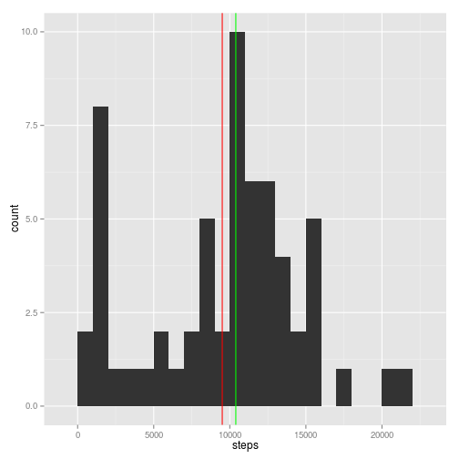

## Loading and preprocessing the data
First we unzip the data te get acess to csv vile inside archive:

```r
unzip('activity.zip')
```
The next step is to load some libraries we need to process the data:

```r
library(ggplot2)
library(scales)
library(reshape2)
```
Read data from the disk:

```r
activity <- read.csv('activity.csv')
```
Initial dataset consists of following columns:

1. **steps**: Number of steps taking in a 5-minute interval (missing values are coded as `NA` ) 
2. **date**: The date on which the measurement was taken in YYYY-MM-DD format 
3. **interval**: Identifier for the 5-minute interval in which measurement was taken

```r
names(activity)
```

```
## [1] "steps"    "date"     "interval"
```

```r
str(activity)
```

```
## 'data.frame':	17568 obs. of  3 variables:
##  $ steps   : int  NA NA NA NA NA NA NA NA NA NA ...
##  $ date    : Factor w/ 61 levels "2012-10-01","2012-10-02",..: 1 1 1 1 1 1 1 1 1 1 ...
##  $ interval: int  0 5 10 15 20 25 30 35 40 45 ...
```

```r
head(activity)
```

```
##   steps       date interval
## 1    NA 2012-10-01        0
## 2    NA 2012-10-01        5
## 3    NA 2012-10-01       10
## 4    NA 2012-10-01       15
## 5    NA 2012-10-01       20
## 6    NA 2012-10-01       25
```

We need to perform some initial steps after loading data. We will transform interval column into factor variable, add levels on it, and add new data.POSIXlt format column:

```r
activity.interval.levels <- sprintf(
        "%04i",
        sort(unique(activity$interval))
    )
activity.date.levels <- sort(unique(as.character(activity$date)))
activity$interval <- sprintf("%04i", activity$interval)
activity$interval <- factor(
        activity$interval, 
        levels = activity.interval.levels
    )
activity$date <- factor(activity$date, levels = activity.date.levels)
activity$time <- as.POSIXlt(
        paste(activity$date, activity$interval, sep = " "),
        format = "%Y-%m-%d %H%M"
    )
```

Columns' description:

1. **steps**: Number of steps taking in a 5-minute interval (missing values are coded as `NA`)
2. **date**: The date on which the measurement was taken in YYYY-MM-DD format
3. **interval**: Identifier for the 5-minute interval in which measurement was taken in HHmm format
4. **time**: identifier of 5-minute interval in POSIXlt format

```r
names(activity)
```

```
## [1] "steps"    "date"     "interval" "time"
```

```r
str(activity)
```

```
## 'data.frame':	17568 obs. of  4 variables:
##  $ steps   : int  NA NA NA NA NA NA NA NA NA NA ...
##  $ date    : Factor w/ 61 levels "2012-10-01","2012-10-02",..: 1 1 1 1 1 1 1 1 1 1 ...
##  $ interval: Factor w/ 288 levels "0000","0005",..: 1 2 3 4 5 6 7 8 9 10 ...
##  $ time    : POSIXlt, format: "2012-10-01 00:00:00" "2012-10-01 00:05:00" ...
```

```r
head(activity)
```

```
##   steps       date interval                time
## 1    NA 2012-10-01     0000 2012-10-01 00:00:00
## 2    NA 2012-10-01     0005 2012-10-01 00:05:00
## 3    NA 2012-10-01     0010 2012-10-01 00:10:00
## 4    NA 2012-10-01     0015 2012-10-01 00:15:00
## 5    NA 2012-10-01     0020 2012-10-01 00:20:00
## 6    NA 2012-10-01     0025 2012-10-01 00:25:00
```
## What is mean total number of steps taken per day?
Summarize total number of steps for aech day by:

```r
steps.day <- as.data.frame(
        tapply(
            activity$steps,
            activity$date,
            sum,
            na.rm = TRUE
        )
    )
colnames(steps.day) <- c("steps")
```
Calculate average and medium number of steps:

```r
mean(steps.day$steps)
```

```
## [1] 9354.23
```

```r
median(steps.day$steps)
```

```
## [1] 10395
```
Make a histogram of the total number of steps taken each day and add mean (red color) and median (gren color) vertical lines:

```r
ggplot(steps.day, aes(x = steps)) +
    geom_histogram(
        binwidth = 1000
    ) +
    geom_vline(
        xintercept = mean(steps.day$steps),
        show_guide = TRUE,
        labels = "Mean",
        color = "Red"
    ) +
    geom_vline(
        xintercept = median(steps.day$steps),
        show_guide = TRUE,
        labels = "Median",
        color = "Green"
    )
```

 


## What is the average daily activity pattern?
To calculate daily activity pattern we will apply mean function to measurements with the same interval value:

```r
steps.mean <- as.data.frame(
        tapply(
            activity$steps,
            activity$interval,
            mean,
            na.rm = TRUE
        )
    )
colnames(steps.mean) <- c("steps.mean")
steps.mean$interval <- row.names(steps.mean)
steps.mean$time <- as.POSIXlt(steps.mean$interval, format = "%H%M")
```
Find the 5-minute interval contains the maximum number of steps average across all the days in the dataset is:

```r
max.steps.mean <- data.frame(
        steps.mean[
            steps.mean$steps.mean == max(steps.mean$steps.mean),
            "time"
        ],
        max(steps.mean$steps.mean)
    )
colnames(max.steps.mean)<-c("interval", "steps")
format(max.steps.mean, format = "%H:%M")
```

```
##   interval    steps
## 1    08:35 206.1698
```
Draw the time series plot. The maximum number of steps is a red dot:

```r
ggplot(steps.mean, aes(x = time, y = steps.mean)) +
    geom_line() +
    scale_x_datetime(
        labels = date_format("%H:%M"),
        breaks = date_breaks("1 hour")
    ) +
    theme(
        axis.text.x = element_text(angle = 90, hjust = 1)
    ) +
    geom_point(
        data = max.steps.mean,
        aes(x = interval,y = steps),
        color = "red"
    )
```

 

## Imputing missing values
To fill `NA` values we choose to fill each interval with the the median value of the interval across all days.
Put the new data into `activity.wo.na` variable and leave origina `activity` untoched

```r
steps.median <- as.data.frame(
        tapply(
            activity$steps,
            activity$interval,
            median,
            na.rm = TRUE
        )
    )
colnames(steps.median) <- c("steps")
steps.median$interval <- row.names(steps.median)
activity.wo.na <- merge(
        activity,
        steps.median[, c("steps", "interval")],
        by = "interval"
    )
activity.wo.na$steps <- ifelse(
        is.na(activity.wo.na$steps.x),
            activity.wo.na$steps.y, 
            activity.wo.na$steps.x
    )
```
Calculate total number of steps for each day for the new dataset:

```r
steps.day.wo.na <- as.data.frame(
        tapply(
            activity.wo.na$steps,
            activity.wo.na$date,
            sum,
            na.rm=FALSE
        )
    )
colnames(steps.day.wo.na) <- c("steps")
steps.day.wo.na$date <- row.names(steps.day.wo.na)
```
Mean and medium values of dataset without `NA`s

```r
mean(steps.day.wo.na$steps)
```

```
## [1] 9503.869
```

```r
median(steps.day.wo.na$steps)
```

```
## [1] 10395
```
Make a histogram of the total number of steps for the new dataset without `NA`s taken each day and add mean (red color) and median (gren color) vertical lines:

```r
ggplot(steps.day.wo.na, aes(x = steps)) +
    geom_histogram(binwidth = 1000) +
    geom_vline(
        xintercept = mean(steps.day.wo.na$steps),
        show_guide = TRUE,
        labels = "Mean",
        color = "Red"
    ) +
    geom_vline(
        xintercept = median(steps.day.wo.na$steps),
        show_guide = TRUE,
        labels = "Median",
        color = "Green"
    )
```

 


## Are there differences in activity patterns between weekdays and weekends?
To figure out the answer we need to create new colum which represent if the meaurement goes to weekday or not:

```r
activity.wo.na$weekday <- !weekdays(
        activity.wo.na[,"time"]) %in% c("Saturday","Sunday"
    )
```
add two new columt to existing variable `steps.mean` which represent the weekday and weekends averages of step for taken interval:

```r
steps.mean$steps.mean.weekends <- tapply(
        activity.wo.na[activity.wo.na$weekday==FALSE,"steps"],
        activity.wo.na[activity.wo.na$weekday==FALSE,"interval"],
        mean,
        na.rm=FALSE
    )
steps.mean$steps.mean.weekday <- tapply(
        activity.wo.na[activity.wo.na$weekday==TRUE,"steps"],
        activity.wo.na[activity.wo.na$weekday==TRUE,"interval"],
        mean,
        na.rm=FALSE
    )
head(steps.mean)
```

```
##      steps.mean interval                time steps.mean.weekends
## 0000  1.7169811     0000 2015-07-20 00:00:00                0.00
## 0005  0.3396226     0005 2015-07-20 00:05:00                0.00
## 0010  0.1320755     0010 2015-07-20 00:10:00                0.00
## 0015  0.1509434     0015 2015-07-20 00:15:00                0.00
## 0020  0.0754717     0020 2015-07-20 00:20:00                0.00
## 0025  2.0943396     0025 2015-07-20 00:25:00                3.25
##      steps.mean.weekday
## 0000         2.02222222
## 0005         0.40000000
## 0010         0.15555556
## 0015         0.17777778
## 0020         0.08888889
## 0025         1.31111111
```
Make a time series plot for weekday and weekends patterns:

```r
steps.mean.melted <- melt(
        steps.mean[, c("interval", "steps.mean.weekday", "steps.mean.weekends")],
        value.name="steps"
    )
```

```
## Using interval as id variables
```

```r
steps.mean.melted$time <- as.POSIXlt(steps.mean.melted$interval, format = "%H%M")
ggplot(steps.mean.melted, aes(x=time, y=steps)) +
    geom_line() +
    scale_x_datetime(
        labels = date_format("%H:%M"),
        breaks = date_breaks("1 hour")
    ) +
    theme(axis.text.x = element_text(angle = 90, hjust = 1)) +
    facet_grid(variable ~ .)
```

 
# Conclusion
It can be noted, that two patterns differ from each other. On weekday walking activity is lower on average, begins at 6:30AM and have a sharp peak at 8:30AM.
